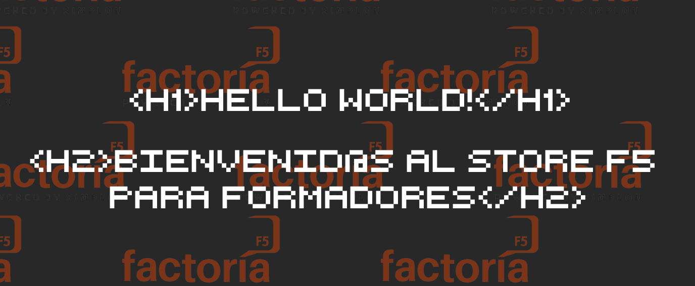

# STORE FACTORIA F5

## Tabla de Contenidos:
1. [Logo](#store-f5)
2. [Introducción](#introducción)
3. [Prototipo del proyecto](#prototipo-del-proyecto)
4. [Tecnologías utilizadas en el proyecto](#tecnologías-utilizadas-en-el-proyecto)
5. [Instalación](#instalación)
6. [Personas autoras](#personas-autoras)

## 💻Logo

## 💠Introduction

Store F5 es una plataforma interna que tiene como finalidad almacenar los recursos de formadores en un mismo lugar.

Al mismo tiempo, el Store contiene un foro para interactuar y comentar todo lo relacionado dentro del mismo.

## 🛠️Prototype

## ⚙️Tecnologías utilizadas en el proyecto:

 

                   

## 🔍Instalación:

*** Tener instalado el Visual Studio Code, Node js y Xampp Control (o Mampp en caso de Mac)
    
- Clonamos el repositorio con el comando:

        git clone https://github.com/Viviana95/proyecto_PEDAGOGICO.git

- Instalamos composer:

        composer install

- Instalamos Node Package Manager:

            npm install
            npm i

- Para poder modificar el proyecto es necesario:
        
    📂 Para verlo en el navegador, se usa el comando:
                

            php artisan server
               

    📂 Para actualizar los cambios en css, usar:
                
            npm run watch
            npm run dev
                
    📂 Para activar el storage:

            php artisan link:storage

    
## Authors

- [@CSanchezCadrecha](https://github.com/CSanchezCadrecha)
- [@Nereka38](https://github.com/Nereka38)
- [@Viviana95](https://github.com/Viviana95)
- [@TaniaRodriguezFdez](https://github.com/TaniaRodriguezFdez)

