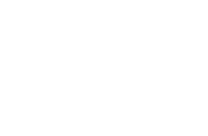

## Tabla de Contenidos:
1. [Logo](#store-f5)
2. [Introducción](#introducción)
3. [Prototipo del proyecto](#prototipo-del-proyecto)
4. [Tecnologías utilizadas en el proyecto](#tecnologías-utilizadas-en-el-proyecto)
5. [Instalación](#instalación)
6. [Personas autoras](#personas-autoras)

## 💻 Store F5:

    
## 💠 Introducción:

Store F5 es una plataforma interna que tiene como finalidad almacenar los recursos de los formadores en un mismo lugar.

## 🛠️ Prototipo del proyecto:
    

## ⚙️ Tecnologías utilizadas en el proyecto:

<ul>    
        <li>HTML</li>
        <li>Node Js</li>
        <li>NPM</li>
        <li>Laravel</li>
        <li>PHP</li>
        <li>Css</li>
        <li>Bootstrap</li>
        <li>Tailwinds</li>
</ul>

## 🔍 Instalación:

     *** Tener instalado el Visual Studio Code, Node js y Xampp Control (o Mampp en caso de Mac)

    
<ul>
        <li>Clonamos el repositorio con el comando:</li>
            
git clone https://github.com/Viviana95/proyecto_PEDAGOGICO.git

        <li>Instalamos composer: </li>
            
composer install

        <li>Instalamos Node Package Manager: </li>
            
npm install / npm i

        <li>Para poder modificar el proyecto es necesario:</li>
            
📂 Para poder verlo en el navegador, se usa el comando:

                
php artisan server

            
📂 Para poder actualizar los cambios en css, usar:

                
npm run watch

            
📂 Para activar el storage:

                
php artisan

        <li>Para correr los test usamos el comando:</li>
            
npm run test

</ul>    

## ✒️ Personas autoras:

<ul>
        <li><a href="">Cristina Sánchez</a></li>
        <li><a href="https://github.com/Nereka38">Nerea Fernandez</a></li>
        <li><a href="">Viviana Trujillo</a></li>
        <li><a href="">Tania Rodríguez</a></li>
</ul>

